# Тестовое задание
<hr>

## Посмотреть проект можно: <i><b><a href="http://flopp.ru">тут</a></b></i>

### Основное задачи:
Реализовать Django + Stripe API бэкенд со следующим функционалом и условиями:
- [x] Django Модель Item с полями (name, description, price) 
- [x] API с двумя методами:
  - GET /buy/{id}, c помощью которого можно получить Stripe Session Id для оплаты выбранного Item. При выполнении этого метода c бэкенда с помощью python библиотеки stripe должен выполняться запрос stripe.checkout.Session.create(...) и полученный session.id выдаваться в результате запроса
  - GET /item/{id}, c помощью которого можно получить простейшую HTML страницу, на которой будет информация о выбранном Item и кнопка Buy. По нажатию на кнопку Buy должен происходить запрос на /buy/{id}, получение session_id и далее  с помощью JS библиотеки Stripe происходить редирект на Checkout форму stripe.redirectToCheckout(sessionId=session_id)

### Дополнительные задачи:
- [x] Запуск используя Docker
- [x] Использование environment variables
- [x] Просмотр Django Моделей в Django Admin панели
- [x] Запуск приложения на удаленном сервере, доступном для тестирования
- [x] Реализовать не Stripe Session, а Stripe Payment Intent.
- [ ] Модель Order, в которой можно объединить несколько Item и сделать платёж в Stripe на содержимое Order c общей стоимостью всех Items
- [ ] Модели Discount, Tax, которые можно прикрепить к модели Order и связать с соответствующими атрибутами при создании платежа в Stripe - в таком случае они корректно отображаются в Stripe Checkout форме. 
- [ ] Добавить поле Item.currency, создать 2 Stripe Keypair на две разные валюты и в зависимости от валюты выбранного товара предлагать оплату в соответствующей валюте

Стэк:
- Python==3.11
- Django==4.1.7
- stripe==5.2.0
<hr>

## Запуск проекта (локально)
1) Сделать fork репозитория и склонировать его к себе на ПК
2) Создать виртуальное окружение <br>```python3 -m venv venv```<br>```source venv/bin/activate```
3) Установить зависимости <br> ```pip install -r requirements.txt```
4) Создать в корне проекта файл `.env` со следующими переменными (скопировать из ```.env.sample```):
    ```
    # Django setup
    DEBUG=  # [True, False]
    ENV_TYPE=  # [local, prod]
    
    # network setting
    PROTOCOL= # [http://, https://] put your protocol here
    DOMAIN=  # put your domain here
    
    # Stripe setup
    STRIPE_PUBLIC_KEY=  # put your key here
    STRIPE_SECRET_KEY=  # put your key here
    ```
5) Перейти в ```./makret``` и применить следующие команды:<br>
```python3 manage.py migrate```<br>
```python3 manage.py fill_data```<br>
```python3 manage.py runserver```

## Запуск проекта (docker / docker-compose)
1) Сделать fork репозитория и склонировать его к себе на ПК
2) В корне проекта создать файл ```.env-prod``` по аналогии с ```.env.sample```
    ```
    # Django setup
    DEBUG=  # [True, False]
    ENV_TYPE=  # [local, prod]
    
    # network setting
    PROTOCOL= # [http://, https://] put your protocol here
    DOMAIN=  # [localhost, 127.0.0.1:8000] put your domain here
    # DOMAIN= localhost/ - доступно для запуска через докер
    # DOMAIN=127.0.0.1:8000 - для запуска локально без докера
    # Stripe setup
    STRIPE_PUBLIC_KEY=  # put your key here
    STRIPE_SECRET_KEY=  # put your key here
    ```
3) Запустить команду ```docker-compose up --build```. 

# Доступ к админке:
- login: admin
- password: admin

<hr>

### Отчет о выполнении основного задания:
1) Django модель (market/itemapp/models.py) <br>
    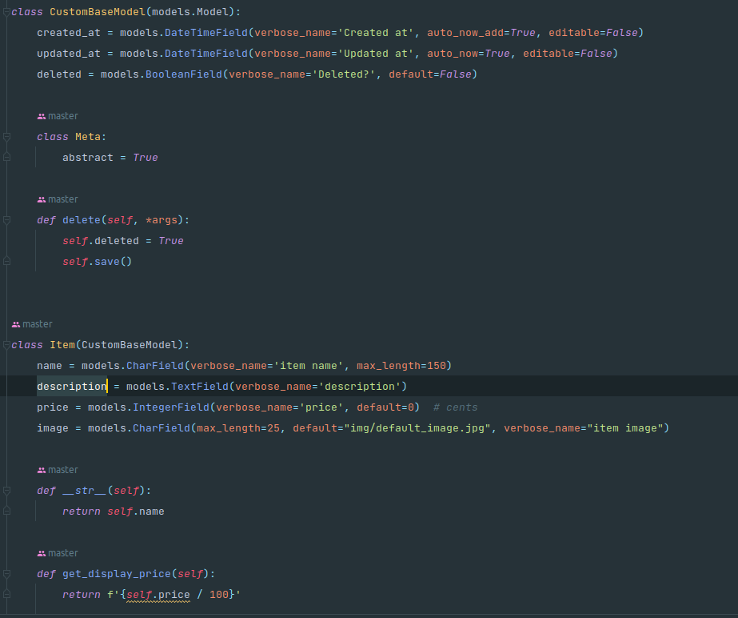 <br><br>
2) GET /buy/{id}<br>
   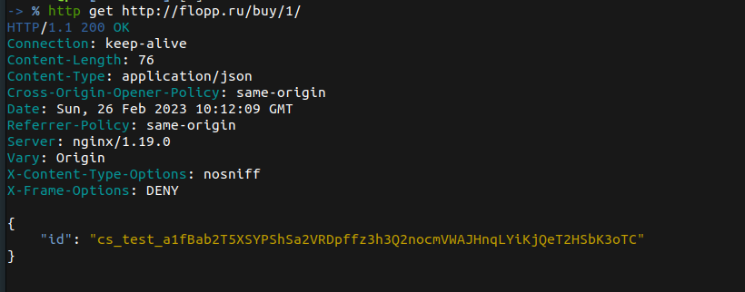 <br><br>
3) GET /item/{id}<br>
    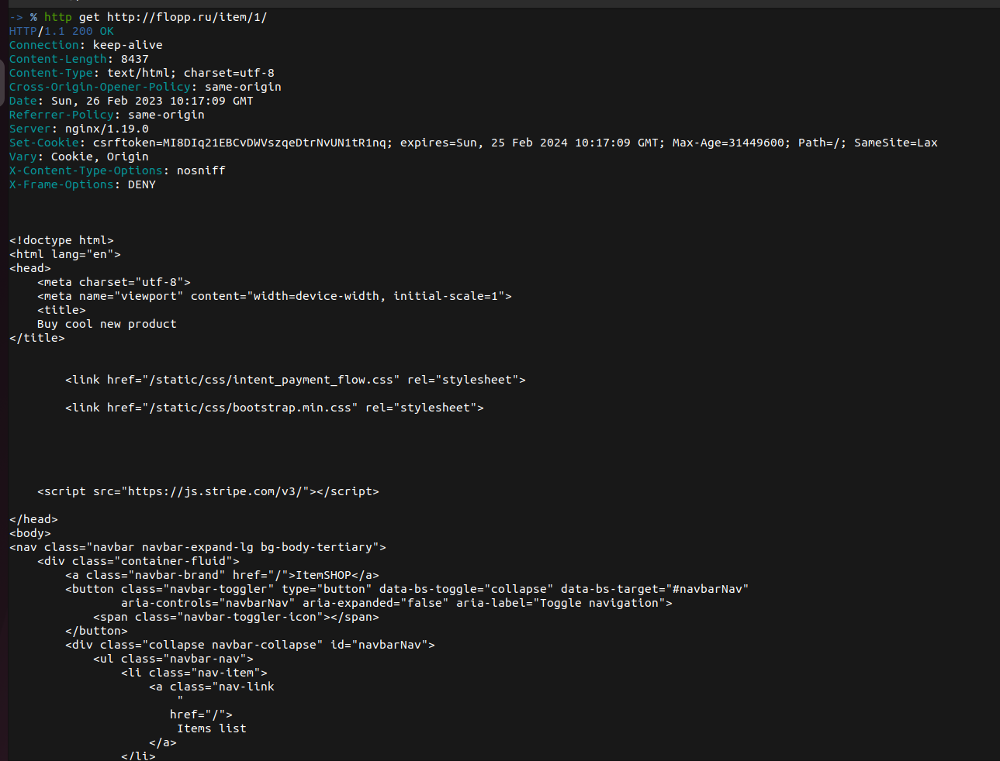

### Отчет о выполнении дополнительных заданий:
1) Запуск используя Docker
   - Docker-compose.yml<br>
   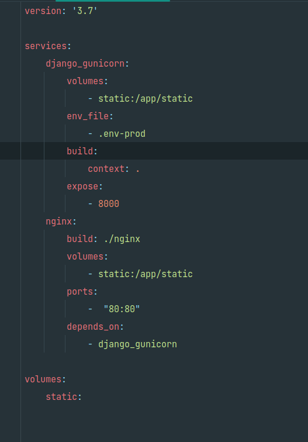 <br><br>
   - Django Dockerfile<br>
   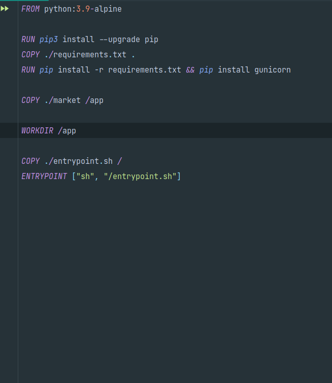 <br><br>
   - Nginx Dockerfile<br>
   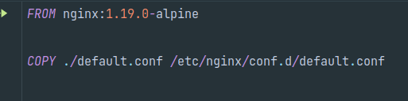 <br><br>
   - Nginx default.conf<br>
   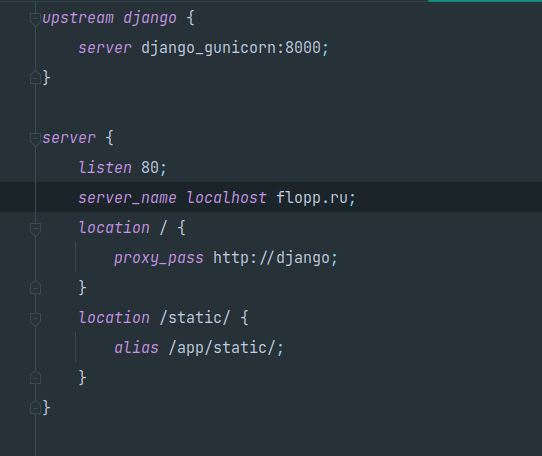 <br><br>
2) Использование environment variables
   - .env.sample<br>
   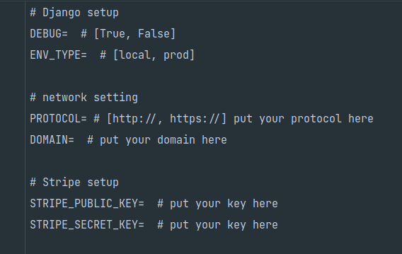 <br><br>
   - market/config/settings.py<br>
   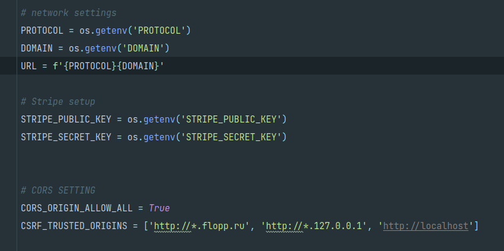 <br><br>
3) Просмотр Django Моделей в Django Admin панели
   - market/itemapp/admin.py<br>
   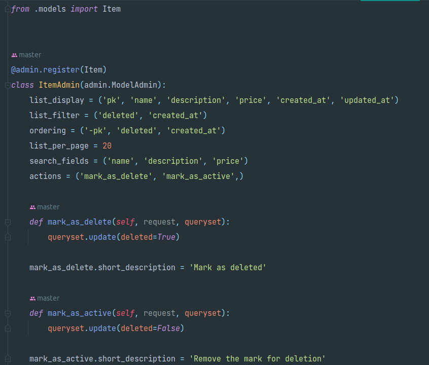 <br><br>
   - flopp.ru/admin<br>
   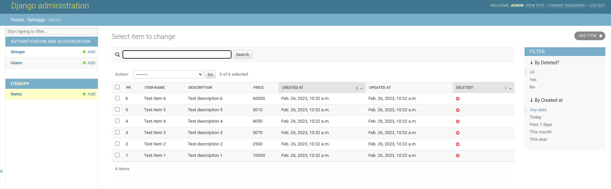 <br><br>
   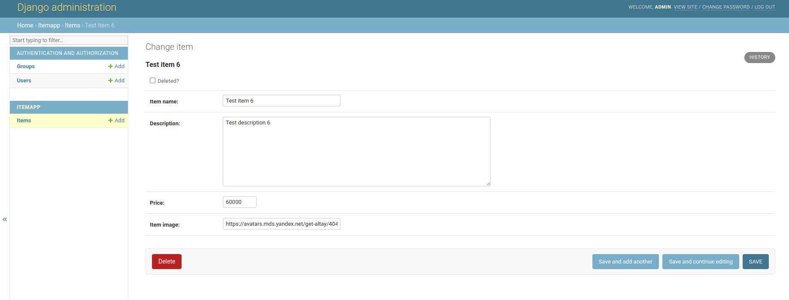 <br><br>
4) Запуск приложения на удаленном сервере, доступном для тестирования: http://flopp.ru
5) Реализовать не Stripe Session, а Stripe Payment Intent.
   - 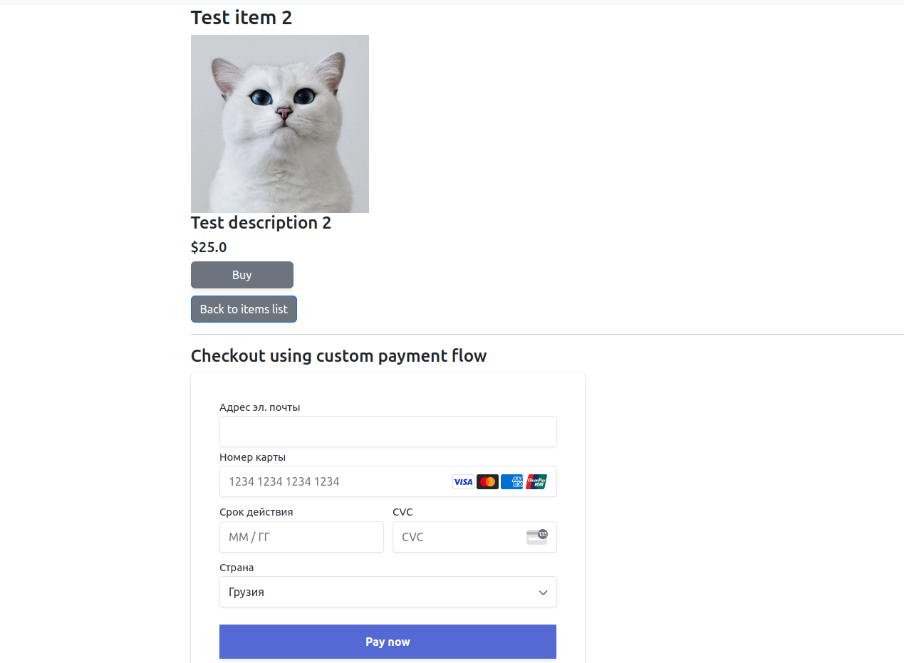 <br><br>
   - 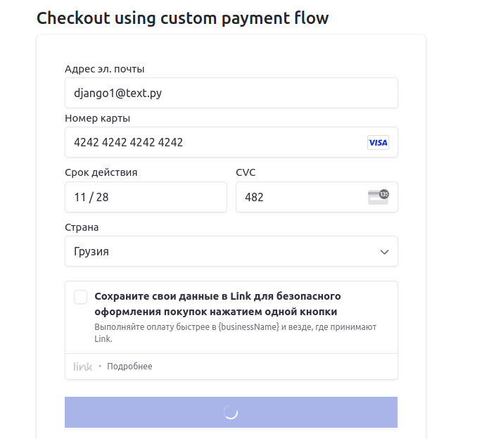 <br><br>
   - 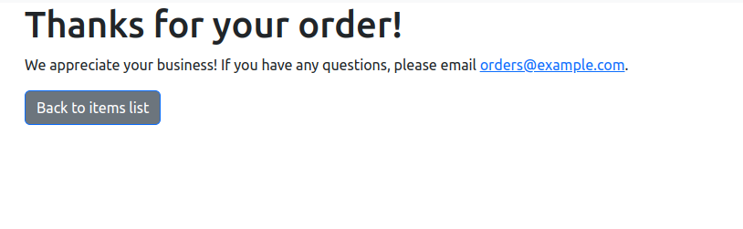
